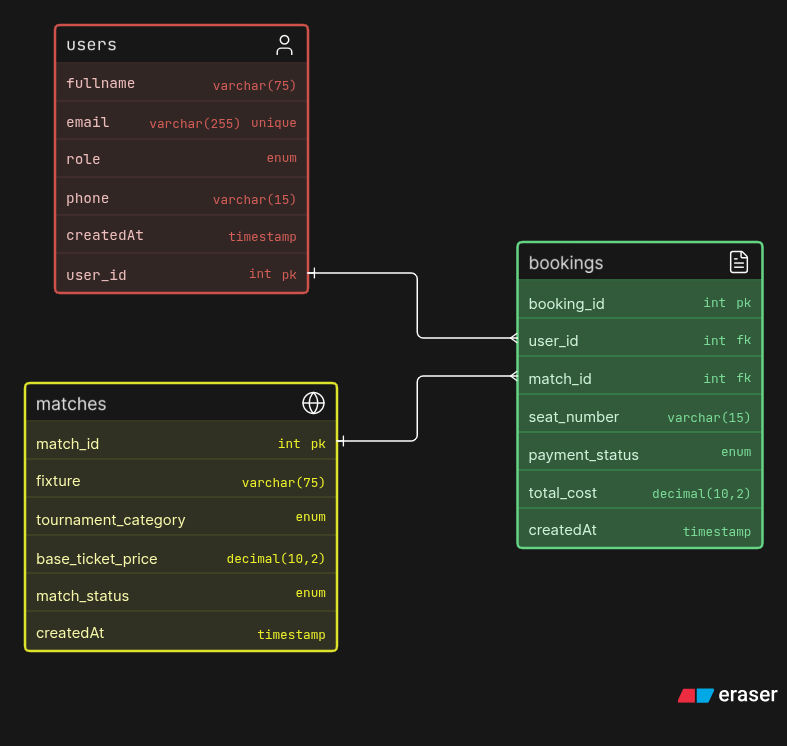

# Football Ticket Booking Database

This repository contains the SQL schema, seed data, and sample queries for a PostgreSQL-based Football Ticket Booking system. It is designed to manage users, match fixtures, pricing, and ticket bookings effectively.

## 📊 Entity-Relationship Diagram (ERD)

*(Replace the placeholder image below with the actual ERD diagram of your database)*



> **Note:** To add your own ERD diagram, simply drop the image into your repository and update the path in this `README.md` file (e.g., `./images/erd.png`).

---

## 🏗️ Database Schema

The database `FootballTicketBooking` consists of three main tables mapped with relational integrity, along with several custom ENUM types for data standardization.

### Custom Data Types (ENUMs)
- **`user_role`**: `Football Fan`, `Ticket Manager`
- **`tournament`**: `Champions League`, `Premier League`, `Serie A`, `La Liga`
- **`match_status`**: `Available`, `Selling Fast`, `Sold Out`, `Postponed`
- **`payment_status_enum`**: `Pending`, `Confirmed`, `Cancelled`, `Refunded`

### Core Tables
1. **`Users`**: Stores user information including `full_name`, `email` (unique), `role`, and `phone_number`.
2. **`Matches`**: Stores fixture details, `tournament_category`, `base_ticket_price`, and current `match_status`.
3. **`Bookings`**: Tracks ticket reservations linking `Users` and `Matches`. Includes details like `seat_number`, `payment_status`, and `total_cost`.

---

## 🔍 Sample Queries Included

The provided SQL script includes several useful queries demonstrating database operations:

**1. Find Available Champions League Matches**
```sql
SELECT match_id, fixture, base_ticket_price 
FROM matches 
WHERE tournament_category = 'Champions League' AND match_status = 'Available';
```

**2. Search Users by Name (Pattern Matching)**
```sql
SELECT user_id, full_name, email 
FROM users 
WHERE full_name ILIKE 'Tanvir%' OR full_name ILIKE '%Haque%';
```

**3. Identify Action-Required Bookings (Handling NULL values)**
```sql
SELECT booking_id, user_id, match_id, 
       COALESCE(payment_status::varchar(10), 'Action Required') AS systematic_status 
FROM bookings 
WHERE payment_status IS NULL;
```

**4. View Full Booking Details (INNER JOIN)**
```sql
SELECT b.booking_id, u.full_name, m.fixture, b.total_cost 
FROM bookings AS b 
INNER JOIN users AS u ON b.user_id = u.user_id 
INNER JOIN matches AS m ON b.match_id = m.match_id;
```

**5. List All Users and Their Bookings (LEFT JOIN)**
```sql
SELECT u.user_id, u.full_name, b.booking_id 
FROM users AS u 
LEFT JOIN bookings AS b ON b.user_id = u.user_id;
```

**6. Find Above-Average Cost Bookings (Subquery)**
```sql
SELECT booking_id, match_id, total_cost 
FROM bookings 
WHERE total_cost > (SELECT AVG(total_cost) FROM bookings);
```

**7. Get Top 2 Most Expensive Matches Excluding the Top 1 (Pagination/Offset)**
```sql
SELECT match_id, fixture, base_ticket_price 
FROM matches 
ORDER BY base_ticket_price DESC 
LIMIT 2 OFFSET 1;
```

---

## 🚀 Setup Instructions

1. Ensure you have **PostgreSQL** installed.
2. Create a new database:
   ```sql
   CREATE DATABASE FootballTicketBooking;
   ```
3. Run the schema creation script to set up `TYPES` and `TABLES`.
4. Execute the `INSERT` statements to seed the sample data.
5. Test the provided queries to analyze the data.